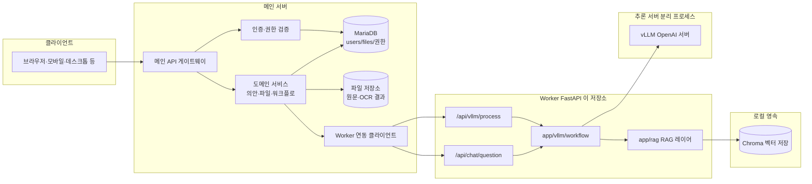
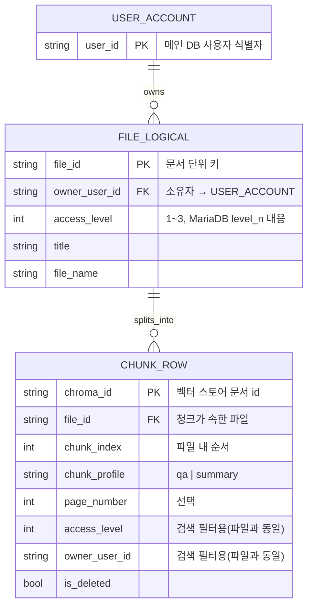
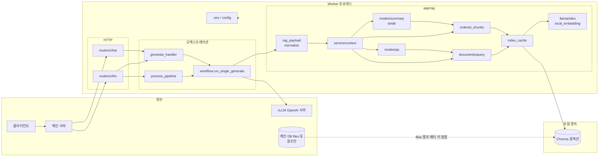
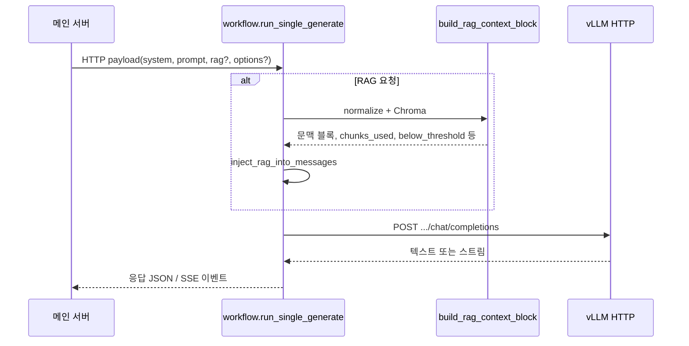
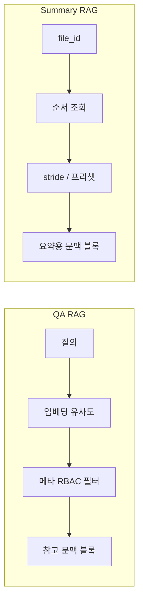
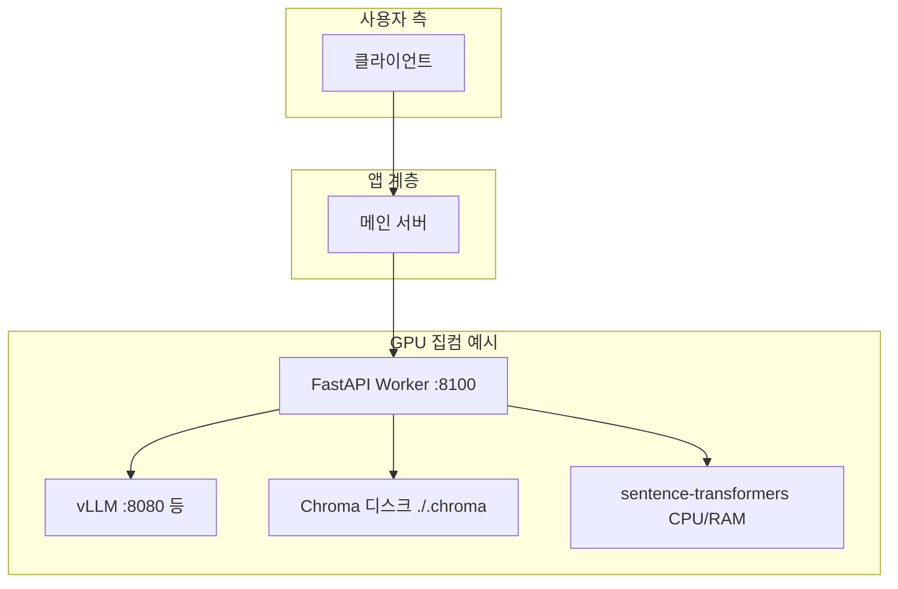

# LocalLLM-OCR project(의회문서요약프로젝트)

## 포트폴리오: 아키텍처 설계·전략·요소별 정리

이 문서는 **ollama-api(vLLM Worker)** 저장소를 포트폴리오·기술 검토용으로 한 번에 읽을 수 있게 묶은 것이다. **도식은 Mermaid**, **전략은 구현 코드 기준**으로 서술한다.  
(`docs/최종 아키텍쳐.md`에는 **향후·목표**로 적힌 ONNX 리랭커 등이 있으나, **현재 저장소 구현**은 아래 「검증된 스택」과 다를 수 있으니 §8을 본다.)

---

## 1. 한 줄 요약

**집컴 GPU에서 vLLM(OpenAI 호환)으로 추론**하고, **같은 머신(또는 네트워크)의 FastAPI Worker**가 의안 **요약(SSE)**·**채팅(QA)** 을 맡는다. RAG는 **Chroma + LlamaIndex + sentence-transformers(로컬 임베딩)** 로, **QA는 시맨틱 검색**, **요약은 파일 순서 스캔(stride)** 이라는 **두 갈래 전략**을 쓴다.

---

## 2. 시스템 맥락(도식)

**역할 구분:** **클라이언트**는 UI·앱만 담당하고, **메인 서버**는 사용자·의안·파일·MariaDB 등 **도메인·게이트**를 맡는다. 이 저장소의 **Worker**는 메인 서버가 호출하는 **LLM·RAG 전용 서비스**(`POST /api/vllm/process`, `POST /api/chat/question`)로 붙는다.

**설계 의도:** LLM 추론(GPU·대용량 의존성)과 RAG·프롬프트 조립을 **Worker 프로세스**로 분리해, Worker는 `VLLM_BASE_URL`(또는 `OLLAMA_BASE_URL`)만 맞추면 **vLLM ↔ Ollama 호환 엔드포인트**를 바꿀 수 있다.

### 2.1 관계형 아키텍처 설계도

아래는 **(가) 도메인·데이터 관계(논리 ER)** 와 **(나) Worker 내부 모듈 의존** 을 분리해 그린 것이다. Chroma에는 **청크 단위 행**으로 메타가 붙고, 메인 DB `files` 행과 맞추기 위한 필드는 `app/rag/documents/types.py` 의 `FileVectorMetadata` 와 동일한 뜻이다.

#### (가) 도메인·저장 논리 (파일 ↔ 청크 ↔ 권한)

**RBAC(논리 관계):** HTTP 요청의 `user_permission_level`·`requesting_user_id` 는 ER 상 **별도 테이블이 아니라** `CHUNK_ROW` 집합에 대한 **필터 조건**이다. 후보 청크는 `(access_level <= user_permission_level) OR (owner_user_id = requesting_user_id)` 일 때만 남는다. 구현은 `documents/query.py` 의 `MetadataFilters` 이다.

#### (나) 런타임 컴포넌트 의존 관계 (프로세스·모듈)

**읽는 법:** 실선 화살표는 **런타임 호출·데이터 흐름**, 점선은 **설정·외부 참조**이다. QA 경로는 `query`·`modes/qa` 중심, Summary 경로는 `ordered_chunks`·`modes/summary` 중심으로 **같은 `build_rag_context_block` 입구**에서 갈린다.

---

## 3. 런타임·배포 전략

| 요소 | 전략 |
|------|------|
| **프로세스 분리** | `run_vllm_server.sh` → vLLM; `uvicorn app.main:app` → Worker. 포트·리소스 격리. |
| **설정 단일 출처** | 필수 키는 **코드 기본값 없이 `.env`만** (`app/config.py`). 기동 시 누락이면 즉시 실패해 **조용한 잘못된 기본값**을 막음. |
| **Upstream 선택** | `OLLAMA_BASE_URL`이 비어 있지 않으면 **우선**, 아니면 `VLLM_BASE_URL`. 둘 다 **`/v1` 포함 URL** 권장. |
| **동시성 제어** | `httpx` + `VLLM_MAX_CONCURRENCY`(세마포어)로 Worker→vLLM 동시 요청 상한 가능. |
| **로깅** | `/process` POST는 **핸들러 반환까지** 시간 로깅(SSE 본문 전체 시간은 별도 측정 불가라 문서화됨). `httpx` INFO는 노이즈 줄이기 위해 WARNING 이상만. |

---

## 4. API 표면(외부 계약)

| 경로 | 역할 | 특징 |
|------|------|------|
| `GET /api/health` | 헬스체크 | PID 반환, stderr에도 한 줄 출력. |
| `POST /api/vllm/process` | 의안 **SUMMARY** | OCR·`big_categories` 등만 받고 **프롬프트·청킹·메타 조립은 Worker** (`app/prompts`, `process_pipeline`). 응답 **SSE**. |
| `POST /api/chat/question` | 질문 1건 | `system`·`question` 필수. RAG 시 RBAC 필드 필수. 내부는 `run_single_generate` 단일 경로. |

**전략:** 공개 HTTP로 노출하는 **요약 엔드포인트는 process 하나**에 모아, **메인 서버**는 “원문/옵션”만 넘기고 **6단원·메타데이터 프롬프트 버전은 Worker가 소유**한다.

---

## 5. 요청 처리 핵심: `run_single_generate`

모든 **chat/completions** 형태 생성은 `app/vllm/workflow.py`의 `run_single_generate`로 수렴한다.

운영에서는 **메인 서버**가 Worker HTTP를 호출한다고 가정한다. 로컬·테스트는 메인 서버 없이 Worker에 직접 붙는 경우도 있다.

**샘플링 병합 전략:** `options`는 `.env` 기본 위에 **요청이 덮어씀**. `rag.mode == summary` 이면 **`SUM_*` / `SUM_DEFT_*`**, 그 외는 **`PROMPT_DEFAULT_*`** (`get_summary_default_prompt_options` vs `get_default_prompt_options`). Ollama식 `num_predict` 등은 `_normalize_sampling`에서 OpenAI 필드로 매핑.

---

## 6. RAG 이중 모드(핵심 전략)

같은 `rag` 페이로드라도 **`mode`에 따라 완전히 다른 수집 전략**을 쓴다 (`app/rag/service/context.py`).

### 6.1 QA 모드 (`mode: qa`)

- **검색:** 질의 임베딩 + 벡터 유사도 상위 k.
- **필터:** Chroma **메타데이터 필터** — `access_level <= user_permission_level` **또는** `owner_user_id == requesting_user_id`.
- **품질 게이트:** `RAG_RETRIEVER_MIN_SCORE` + `RAG_RETRIEVER_SCORE_SEMANTICS`(`similarity` vs `distance`)로 **하한/상한** 해석 고정.
- **선택:** `chunk_profile == qa` 강제 여부(`require_chunk_profile_qa`).
- **출력 포맷:** `app/rag/modes/qa/context.py`에서 `출처: [파일명] (Lv.N)` 형태로 문맥 블록 구성.

**전략 요약:** “의미로 찾되, **권한 밖 문서는 빼고**, **소유자는 예외 통과**”.

### 6.2 Summary 모드 (`mode: summary`)

- **검색 안 함:** 벡터 유사도로 질의-청크 매칭하지 않는다.
- **수집:** `file_id` 기준 **`ordered_chunks.fetch_chunks_ordered_by_file`** 로 순서대로 모은 뒤, **`chunk_stride_selection`** + `summary_chunk_presets`로 **stride 샘플링**해 긴 문서를 컨텍스트 한도에 맞춘다.
- **RBAC:** 동일하게 메타 필터 후 행만 사용.

**전략 요약:** “한 파일의 **서사 순서**를 지키면서, **프리셋으로 일부만** 넣어 요약 품질·토큰 예산을 맞춘다”.

---

## 7. 패키지·모듈 맵(요소별)

| 영역 | 경로 | 책임 |
|------|------|------|
| 진입 | `app/main.py` | FastAPI 앱, CORS, `/api/vllm`·`/api/chat` 마운트, `/process` 디버그 로깅 미들웨어. |
| 설정 | `app/config.py` | `.env` 필수 키, upstream URL, 프롬프트 기본·요약 기본, 타임아웃·동시성. |
| 라우터 | `app/routers/vllm.py`, `chat.py` | 요청 스키마·RBAC 필드 검증, `generate_handler`로 생성 위임. |
| 생성 오케스트레이션 | `app/vllm/workflow.py` | RAG 주입, HTTP 스트리밍/비스트리밍, vLLM 오류 파싱. |
| 의안 요약 파이프라인 | `app/vllm/process_pipeline.py` | OCR 텍스트 → 부분 청킹 → 메모 누적 → 최종 요약·메타데이터 다단계. 내부 `rag: summary` 바디로 `run_single_generate` 재사용. |
| 청킹·후처리 | `summary_chunking.py`, `summary_postprocess.py` | 페이지 추정, 오버랩 청크, 토큰 예산, 메타 `max_tokens` 자동 보정 등. |
| 프롬프트 | `app/prompts/summary.py` | Worker 전용 시스템·유저 프롬프트 조립. |
| 스키마 | `app/schemas/llm_process.py` | `LLMProcessRequest` 계약. |
| 인증 | `app/vllm/process_auth.py` | `WORKER_JWT_SECRET` 설정 시 `Authorization: Bearer` + `user_id` 일치. 미설정 시 로컬 개발용으로 생략 가능. |
| RAG 설정 | `app/rag/config/settings.py` | Chroma 경로, 컬렉션, 임베딩 모델, 청크 크기, retriever 점수 등. |
| 임베딩 | `app/rag/llamaindex/local_embedding.py` | `sentence-transformers` 기반 LlamaIndex 연동. |
| 인덱스 | `app/rag/chroma/index_builder.py`, `index_cache.py` | `VectorStoreIndex` 구축·**모듈 단위 캐시**(`get_vector_index`). |
| 인제스트 | `app/rag/documents/ingest.py` | 긴 텍스트 → 프로필별 청킹(`qa`/`summary`), 메타 채움. |
| 전처리 | `app/rag/documents/text_preprocess.py` | 페이지 마커 등. |
| 검색 | `app/rag/documents/query.py` | `MetadataFilters` 조립, 스코어 필터, 삭제 플래그 제외. |
| 권한 상수 | `app/rag/documents/access_level.py` | `level_1~3` → 정수 1~3 저장 규칙. |
| 서비스 레이어 | `app/rag/service/context.py`, `rag_payload.py`, `context_format.py` | 페이로드 정규화, 문맥 문자열, 메시지 주입 위치(`user_prefix` 등). |
| 모드 구현 | `app/rag/modes/qa/`, `modes/summary/` | QA 포맷·검색 래핑 vs 요약 stride 선택. |
| 테스트 | `tests/` | 전처리, 인제스트 우선순위, QA 쿼리, 스모크 등. |

---

## 8. 문서·구현 정합성(포트폴리오용 주의)

| 문서/설명 | 실제 코드와의 관계 |
|-----------|-------------------|
| `docs/최종 아키텍쳐.md` | **GPU·vLLM·동시 시퀀스** 등 인프라 방향은 유효하나, **ONNX 리랭커·AsyncQueryEngine 강조** 등은 **로드맵/목표**에 가깝다. |
| `README.md`·`docs/embed/rag-embedding-hybrid-strategy.md` | **임베딩은 `sentence-transformers` 고정**, HTTP 원격 임베딩 분리는 제거된 방향(리팩터 요약이 README에 있음). 하이브리드·RRF는 **개선 단계**로 문서화됨. |
| 검증된 RAG 검색 경로 | **Dense 벡터 검색 + 메타 필터 + 점수 하한**이 중심이다. |

포트폴리오에서는 “**문서에 있는 목표**”와 “**저장소에 있는 구현**”을 한 문단으로 구분해 적는 것이 신뢰도에 유리하다.

---

## 9. 보안·운영 전략 요약

- **RAG QA·요약:** `user_permission_level` + `requesting_user_id`로 **RBAC**; 누락 시 API 단에서 거절 또는 SSE `rag_error` 경로.
- **요약 API:** 선택적 **JWT**로 호출 주체와 `user_id` 바인딩.
- **재인덱싱:** 임베딩/차원·메타 키(`owner_user_id` 등) 변경 시 **Chroma 재구축** 필요 — README 운영 주의에 명시.
- **점수 해석:** 스택마다 similarity 정의가 다를 수 있어 `.env`의 semantics로 **고정**하고 샘플 쿼리로 튜닝하라고 안내.

---

## 10. 테스트·품질 전략

- `unittest` 기반 스모크·단위 테스트(`tests/`).
- RAG·쿼리·전처리·청크 우선순위 등 **회귀 방지**에 초점.
- Worker와 vLLM은 **별도 프로세스**이므로 CI에서는 환경에 따라 스모크만 선택 실행하는 식이 현실적.

---

## 11. 한 페이지용 다이어그램(배포 뷰)

---

**문서 버전:** 저장소 스냅샷 기준 정리. API·환경 변수의 상세 표는 **`README.md`** 를 정본으로 삼는다.
